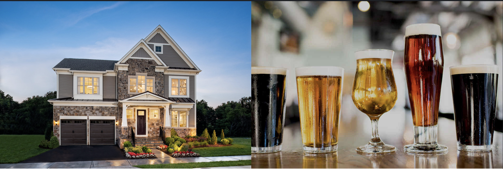

```{r, echo=FALSE, results='hide', message=FALSE}
suppressMessages(library(here))

here("images", "Brewhomeimage.png")
```


```{r, echo=FALSE, out.width = "100%"}


```

The `BrewHome` package contains four functions `get_brewery()`, `get_brewery_bystate()`, `get_breweryhomeinfo()`, and `plot_breweryhomemap()`. 

## `get_brewery()` Function

The `get_brewery()` function helps the user create a small dataframe using a BreweryDB sandbox API. The user simply needs to enter their own BreweryDb API key into the function and the function will return a small dataset that contains different information about breweries, including thier locations. 

The dataframe should look something like the below: 

```{r, echo=FALSE, results='hide', message=FALSE}
suppressMessages(library(here))

here("images", "brewerydata.png")
```

```{r, echo=FALSE,  out.width = "100%"}

```


```{r eval=FALSE}
library(BrewHome)
get_brewery()
```
## `get_brewery_bystate()` Function

The `get_brewery_bystate()` fucntion allows the user to filter out information from the brewery dataset by state. It is required that the user selects a specific state to search, otherwise all brewery data will be returned. 

```{r eval=FALSE}
library(BrewHome)
get_brewery_bystate()
```

## `get_breweryhomeinfo()` Function

The `get_breweryhomeinfo()` fucntion includes BreweryDB data and data from Zillow and Realtor.com. The Zillow and Realtor.com data are both for the month of October, 2019. This function allows the user to search information about average home listing prices and typical rental costs around breweries in the U.S. The user is required to enter a specific state they would like to search. 

    get_breweryhomeinfo(state = "Colorado)

If the state is not included in the small dataset the user will receive an error, such as: 

    Due to the small size of the dataset, this state does not have any available information. Please choose a different U.S state from the following list: New York, Pennsylvania, Virginia, North Carolina, South Carolina, Georgia, Florida, Tennessee, Ohio, Mchigan, Wisconsin, Illinois, Missouri, Texas, Colorado, California. 
    
If the state they entered is not capitalized, as states shoudl be, the user will also receive an error: 

    States should always be capitalized!! Capitalize and re-run the function!


If the information entered is a state in the dataset, the user will receive a dataset with home valuation and brewery information.  


```{r eval=FALSE}
library(BrewHome)
get_breweryhomeinfo()
```

## `plot_breweryhomemap()` Function

The `plot_breweryhomemap()` function includes BreweryDB, Zillow, and Realtor.com data. The Zillow and Realtor.com data are both for the month of October, 2019. The function plots this data using a leaflet interactive map. There is no input required, but when the user runs the function it will return a map of the U.S with popups of each brewery location. When the user clicks on the popups of each location they will be able to see information about the brewery, the average home listing price in the area, and the typical rental cost in the area. 

The map will look like the following: 


```{r eval=FALSE}
BrewHome::plot_breweryhomemap()
```


```{r eval=FALSE}
library(BrewHome)
plot_breweryhomemap()
```


## Summary Statistics from `brewery_sales_rentals.Rdata` File

These summary statistics are here to show you what kind of information can be found in the `brewery_sales_rentals.Rdata` file, which is what is used to create the `get_breweryhomeinfo()` and `plot_breweryhomemap()` functions in this package. 


###### Average listing price by brewery

This table shows the average home listing price of all homes near each brewery by name. For example the mean home sale listing around anheuser-Busch breweries is about $418,851.  

```{r, echo=FALSE, results='hide', message=FALSE}

suppressMessages(library(dplyr))

load(file = "~/Desktop/BrewHome/data/brewery_sales_rentals.rda")
```

```{r}
Avg_brew_homeprice <- brewery_sales_rentals %>%
  group_by(Brewery) %>%
  summarise(mean = mean(`Average Listing Price`))

Avg_brew_homeprice 
```


###### Typical Rental price by brewery

This table shows the typical rental cost of all homes near each brewery by name. For example the mean rental cost around anheuser-Busch breweries is about $1510. 

```{r}
Avg_brew_rentalprice <- brewery_sales_rentals %>%
  group_by(Brewery) %>%
  summarise(mean = mean(`Typical Rent Price`))

Avg_brew_rentalprice 
```


###### Average listing price by the type of brewery

This table shows the avergae home sale price of all homes near each brewery facility type. For example the mean home listing price around Brewppubs is about $1,317,838. 

```{r}
Avg_brewtype_homeprice <- brewery_sales_rentals %>%
  group_by(`Brewery Type`) %>%
  summarise(mean = mean(`Average Listing Price`))

Avg_brewtype_homeprice 
```


## Additional Code for Package

For more information on the additional code used to create this package, please see the `Extra-code-vignette` document in the `/vignettes` folder of the package. 


## Sources Used for this Package 


BreweryDB Data: 

  https://www.brewerydb.com/developers/docs
 
 
Zillow Rental Data: 


  https://www.zillow.com/research/data/
  
  
Realtor.com Data: 

  https://www.realtor.com/research/data/


Sources can also be found in the `/R` file of the package in the document titled `data.R`. 


